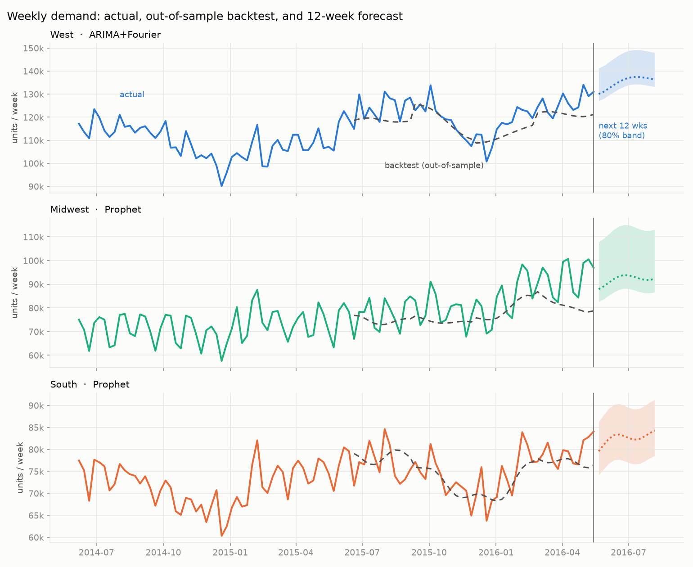
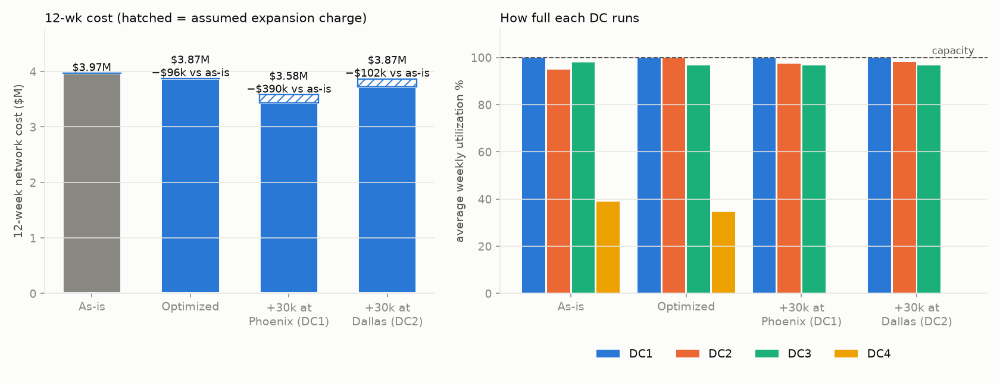

# Distribution Center Demand Forecast & Capacity Optimization

**Business question:** *Given the next 12 weeks of predicted orders, how should we assign regional demand across distribution centers (DCs) to stay within capacity at the lowest shipping + handling cost — and is it worth adding capacity?*

> **Tableau Public dashboard:** [DC Capacity Dashboard](https://public.tableau.com/app/profile/naveen.k7476/viz/DCCapacityDashboard/DCCapacityDashboard) (forecast vs actual by region, DC utilization, scenario cost). Build steps: [docs/tableau_guide.md](docs/tableau_guide.md)



## Recommendation (12-week horizon, base forecast)

Run the optimizer and stop sending West overflow to Atlanta: re-assigning volume across the existing four DCs cuts network cost **2.4% (≈ USD 96k)** with no capex. The binding constraint is **Phoenix (DC1)**: West demand (~135k units/week forecast) exceeds Phoenix's 100k/week, and that overflow is what is expensive. **Adding 30k units/week at Phoenix saves ≈ USD 438k in operating cost; after an assumed USD 144k expansion charge it nets ≈ USD 294k (a further 7.6% cost cut, 9.8% total vs. today) and stays positive up to ≈ USD 1.22 per unit-week of added capacity.** Adding the same capacity at **Dallas (DC2) is not worth it** — gross saving ≈ USD 151k vs the USD 144k charge (break-even at USD 0.42 per unit-week). **Atlanta (DC4) runs only ~35% full** (and is idle once Phoenix expands), so it is the candidate to right-size or sublease. Under a high-demand stress case (+12.7%, upper 80% band) the ranking is the same and the network relies on Atlanta.

| Scenario (base demand) | 12-wk cost | vs as-is | Pros | Cons |
|---|---|---|---|---|
| 0 As-is (home DC, cost-blind spill) | USD 3.97M | – | no change | West overflow lands in the wrong DC |
| 1 Optimized, current capacity | USD 3.87M | −2.4% | no capex, quick to implement | DC1/DC2 at 100% — no headroom for a demand surprise |
| 2 Optimized + 30k/wk at **Phoenix** | USD 3.58M | **−9.8%** | biggest saving, removes the West bottleneck | needs a lease/build; Atlanta becomes stranded |
| 3 Optimized + 30k/wk at **Dallas** | USD 3.87M | −2.6% | helps South + West overflow | savings ≈ expansion cost → roughly break-even |



## ⚠ What is real and what is assumed
* **Real:** demand history (Walmart M5, Kaggle), the forecasts and their backtest error.
* **Assumed (synthetic, mine):** the four DCs (Phoenix, Dallas, Chicago, Atlanta), their weekly capacities (sized so the network is ~85–90% utilized), handling cost per unit, the shipping-rate formula (USD 0.15 + 0.085 per 100 miles, great-circle distance from DC to each region's anchor city), the 3PL overflow price (USD 3/unit), the expansion price (USD 0.40 per added unit-week), and the "as-is" rule. Inputs are in [`data/dc_network.csv`](data/dc_network.csv) and [`data/shipping_costs.csv`](data/shipping_costs.csv); **dollar figures show the method and the shape of the trade-off, not a real company's P&L.**
* M5 is Walmart retail (not pharmacy); it is used as a stand-in for retail/pharmacy unit demand. Regions are states: CA → West, TX → South, WI → Midwest (10 stores).

## Project structure
| Part | What | Where |
|---|---|---|
| 1 Explore & clean | store-day → store-week → region-week; trend, seasonality, quality checks; SQL on SQLite | [`notebooks/01_explore_clean.ipynb`](notebooks/01_explore_clean.ipynb), [`sql/01_explore.sql`](sql/01_explore.sql), [`src/prepare_data.py`](src/prepare_data.py) |
| 2 Forecast | Prophet vs ARIMA+Fourier vs seasonal naive, rolling-origin backtest, 12-week forecast | [`notebooks/02_forecast.ipynb`](notebooks/02_forecast.ipynb), [`src/forecast.py`](src/forecast.py) |
| 3 Optimize | weekly linear program (PuLP + HiGHS), 4 scenarios × 2 demand cases | [`notebooks/03_optimize.ipynb`](notebooks/03_optimize.ipynb), [`src/optimize.py`](src/optimize.py), [`src/network.py`](src/network.py) |
| 4 Show results | Tableau-ready CSVs + static charts | [`data/outputs/`](data/outputs), [`docs/tableau_guide.md`](docs/tableau_guide.md), [`assets/`](assets) |

## Results at a glance
**Forecast accuracy** (MAPE over 48 out-of-sample weeks per region):

| Region | Seasonal naive | ARIMA+Fourier | Prophet | Chosen |
|---|---|---|---|---|
| West | 10.3% | **3.9%** | 4.8% | ARIMA+Fourier |
| South | 5.6% | 4.7% | **4.1%** | Prophet |
| Midwest | 13.1% | 9.0% | **8.8%** | Prophet |

Both models cut error ~40% vs the seasonal-naive baseline (5.8% vs 9.7% overall). All models under-forecast (bias −1% to −7%), most for fast-growing Midwest, so the high-demand case matters.

**Optimization model** (solved per forecast week):
`min Σ (ship[r,d] + handle[d])·x[r,d] + P·overflow`  s.t. `Σ_d x[r,d] + overflow[r] = demand[r]`, `Σ_r x[r,d] ≤ capacity[d]`.
The explicit 3PL overflow lane keeps the LP feasible and quantifies any shortfall (it was unused in every scenario here).

## Reproduce
```bash
python3 -m venv venv && source venv/bin/activate
pip install -r requirements.txt
# download the M5 data (calendar.csv, sales_train_evaluation.csv) from
# https://www.kaggle.com/competitions/m5-forecasting-accuracy/data  ->  data/raw/
./run_pipeline.sh          # or open the notebooks in order
```
Raw data (430 MB) is git-ignored; processed and output CSVs are committed.

## Limitations / next steps
* Region-level, not item-level forecasts; no promotions, prices or SNAP-day regressors.
* Single-echelon, deterministic LP: no inventory, lead times, minimum-fill or fixed DC costs; the prediction band is empirical.
* Alteryx: [docs/alteryx_guide.md](docs/alteryx_guide.md) specifies the Part 1 prep as an Alteryx workflow with check totals (to be built in Designer).
* Next: add a stochastic/robust capacity model, and sensitivity of the expansion decision to the capacity price.
